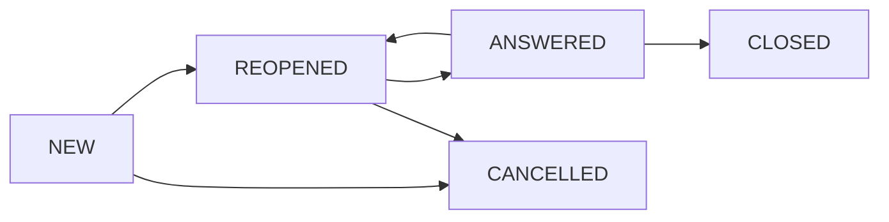

### 🛠 주요 보완 내용
1.  **기술 스택(Tech Stack) 명시**: AI 에이전트가 코드를 생성할 때 기준이 될 FE(Vue3/Nuxt3), BE(Spring Boot), DB(PostgreSQL)를 추가했습니다.
2.  **상태 머신 고도화**: 실무에서 빈번한 '진행 중(IN_PROGRESS)'과 '재질의(REOPENED)' 상태를 추가하여 워크플로우의 현실성을 높였습니다.
3.  **개인정보 및 보안**: 상담 시스템 특성상 필수적인 '개인정보 마스킹' 및 '데이터 보존 정책'을 비기능 요구사항에 보완했습니다.

---

# [개정] 샘플프로젝트 — 고객 Q&A 시스템 (가칭 "Helpdesk Lite")

> 본 문서는 단계별 산출물의 일관된 참조를 위한 최상위 정의서(SSOT)이며, 모든 하위 산출물은 본 정의를 기준으로 작성한다.

---

## 1. 프로젝트 개요

| 항목 | 내용 |
|---|---|
| **프로젝트명** | 사내 고객 Q&A 시스템 (**Helpdesk Lite**) |
| **발주사** | (가상) 중견 제조업체 (A사) |
| **배경 및 목적** | 파편화된 고객 문의(메일, 전화)를 통합 채널로 일원화하고 SLA 준수율을 가시화함 |
| **수행 기간** | 2026-05-01 ~ 2026-08-31 (4개월) |
| **투입 인력** | 6명 (PM 1, 분석·설계 2, 개발 2, QA 1) |
| **주요 기술 스택** | **FE**: Vue3/Nuxt3, **BE**: Spring Boot 3.x, **DB**: PostgreSQL, **Infra**: AWS |

## 2. 업무 범위 (Scope)

| 구분 | 상세 내용 |
|---|---|
| **In-Scope** | 문의 등록/조회, 답변 처리, 통합 검색, 이메일 알림(SMTP), SLA 통계 대시보드 |
| **Out-of-Scope** | AI 자동 답변(Phase 2 예정), 실시간 채팅(챗봇), 외부 소셜 계정 연동 |

## 3. 권한 및 인증 (Role & Auth)

| 역할 | 설명 및 핵심 권한 |
|---|---|
| **USER (고객)** | 일반 사원. 본인 문의 등록, 본인 게시글 수정/삭제/조회 |
| **AGENT (상담사)** | 고객 지원팀. 모든 문의 조회, 답변 작성, 상태 변경(진행/완료) |
| **ADMIN (관리자)** | 시스템 관리자. 카테고리 코드 관리, 사용자 권한 관리, 전사 SLA 통계 조회 |

> **인증 방식**: ID/PW 기반 자체 인증 (BCrypt 암호화, JWT Stateless 세션, 30분 유효)

## 4. 핵심 데이터 모델링 (Entity)

| 엔티티명 | 설명 | 핵심 속성 |
|---|---|---|
| **INQUIRY** | 문의글 정보 | inquiry_id(PK), title, content, status, category_cd, sla_due_dt, reg_id, reg_dt |
| **ANSWER** | 답변 정보 | answer_id(PK), inquiry_id(FK), content, agent_id, reg_dt |
| **ATTACHMENT** | 첨부파일 | file_id(PK), inquiry_id(FK), file_path, origin_name, file_size, reg_dt |
| **USER** | 사용자 정보 | user_id(PK), login_id, password, name, role, email, dept_nm |
| **COMMON_CODE** | 공통 코드 | group_cd, code, code_nm, use_yn, sort_ord |

## 5. 문의 상태 머신 (Status Machine)

* **NEW**: 문의 접수 직후
* **IN_PROGRESS**: 상담사가 담당자로 지정되어 검토 중
* **ANSWERED**: 답변 등록 완료 (고객 확인 대기)
* **REOPENED**: 고객이 답변 확인 후 추가 질문 등록
* **CLOSED**: 고객이 구매 확정(종료) 처리 혹은 답변 후 7일 경과 시 자동 종료

## 6. 핵심 비즈니스 기능 (Key Functions)

| 기능 ID | 기능명 | 주요 설명 |
|---|---|---|
| **FR-INQ-001** | 문의 등록 | 제목, 내용(에디터), 카테고리 선택 및 파일 첨부(최대 3개) |
| **FR-INQ-002** | 답변 처리 | AGENT 권한자가 답변 작성 시 상태를 'ANSWERED'로 변경 |
| **FR-INQ-003** | 통합 검색 | 제목+내용 키워드 검색 및 기간/카테고리/상태 필터링 |
| **FR-INQ-004** | SLA 알림 | 마감 4시간 전 담당 AGENT에게 이메일 발송 및 대시보드 경고 표시 |
| **FR-INQ-005** | 대시보드 | 카테고리별 접수 현황, 평균 답변 소요 시간, SLA 준수율 통계 |

## 7. 비기능 요구사항 (NFR)

| 항목 | 지표 및 목표값 |
|---|---|
| **성능 (Response)** | 조회성 화면 응답 1.0초 이내, API 처리 0.5초 이내 (95th percentile) |
| **동시성 (Concurrency)** | 평시 200명 이상 동시 접속 시 성능 저하 없음 |
| **보안 (Security)** | 비밀번호 복호화 불가 단방향 암호화, 상담 기록 내 개인정보 마스킹 처리 |
| **가용성 (Availability)** | 월간 가용률 99.5% 이상 유지 (정기 점검 제외) |
| **SLA 정책** | 모든 문의는 접수 후 24시간(영업일 기준) 이내에 1차 답변 완료 |

## 8. 외부 인터페이스 연계

| 연계 대상 | 연계 방식 | 용도 |
|---|---|---|
| **사내 SMTP 서버** | JavaMailSender (SMTP) | 문의 접수 알림, 답변 완료 통보, SLA 임박 경고 메일 발송 |

## 9. 표준 산출물 ID 체계

| 분류 | 형식 | 예시 |
|---|---|---|
| **요구사항** | `REQ-[분류]-[No]` | REQ-INQ-001 |
| **화면(UI)** | `UI-[분류]-[No]` | UI-INQ-LIST-01 |
| **API 명세** | `API-[분류]-[No]` | API-INQ-DETAIL-01 |
| **DB 테이블** | `TB_[단수형_대문자]` | TB_INQUIRY |
| **테스트케이스** | `TC-[분류]-[No]` | TC-INQ-001 |
| **결함(Defect)** | `ERR-[분류]-[No]` | ERR-INQ-005 |

---
